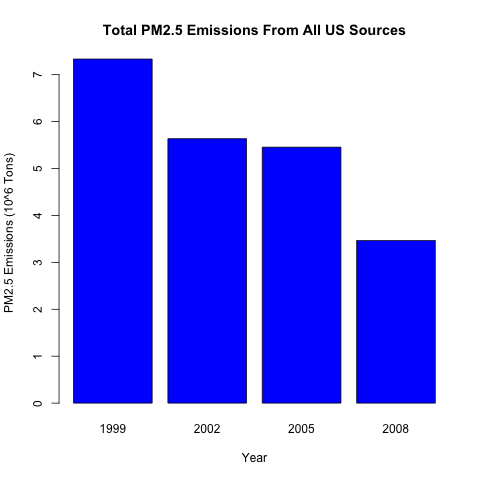
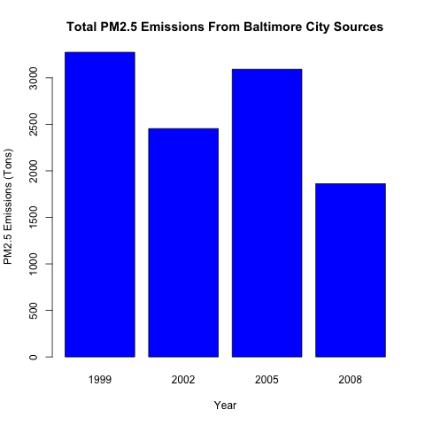
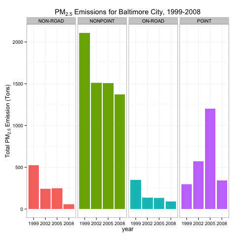
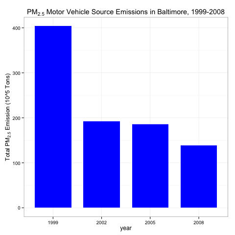
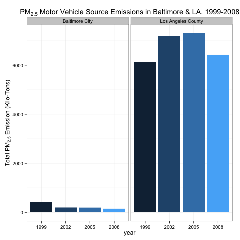

Exploratory Data Analysis - Course Project 2
============================================

Introduction

Fine particulate matter (PM2.5) is an ambient air pollutant for which there is strong evidence that it is harmful to human health. In the United States, the Environmental Protection Agency (EPA) is tasked with setting national ambient air quality standards for fine PM and for tracking the emissions of this pollutant into the atmosphere. Approximatly every 3 years, the EPA releases its database on emissions of PM2.5. This database is known as the National Emissions Inventory (NEI). You can read more information about the NEI at the EPA National Emissions Inventory web site.

For each year and for each type of PM source, the NEI records how many tons of PM2.5 were emitted from that source over the course of the entire year. The data that you will use for this assignment are for 1999, 2002, 2005, and 2008.

The data for this assignment are available from the course web site as a single zip file:
<https://d396qusza40orc.cloudfront.net/exdata%2Fdata%2FNEI_data.zip>

## FILE: NEI_data.R
The file "NEI_data.R" will automatically download and extract the ZIP file, load the "*.rds" files into R memory. It also saves the two data.frames (NEI & SCC) into a ".rsa" file for restarting R in this state. NEI & SCC data.frames can be loaded via
```
load("NEI_data.rsa")
```

##Assignment

The overall goal of this assignment is to explore the National Emissions Inventory database and see what it says about fine particulate matter pollution in the United states over the 10-year period 1999–2008. You may use any R package you want to support your analysis.

1. Have total emissions from PM2.5 decreased in the United States from 1999 to 2008? Using the base plotting system, make a plot showing the total PM2.5 emission from all sources for each of the years 1999, 2002, 2005, and 2008.

Plot 1: Total PM2.5 Emissions From All US Sources
 

2. Have total emissions from PM2.5 decreased in the Baltimore City, Maryland (fips == "24510") from 1999 to 2008? Use the base plotting system to make a plot answering this question.

Plot 2: Total PM2.5 Emissions From Baltimore City Sources


3. Of the four types of sources indicated by the type (point, nonpoint, onroad, nonroad) variable, which of these four sources have seen decreases in emissions from 1999–2008 for Baltimore City? Which have seen increases in emissions from 1999–2008? Use the ggplot2 plotting system to make a plot answer this question.

Plot 3: PM2.5 Emissions for Baltimore City, 1999-2008


4. Across the United States, how have emissions from coal combustion-related sources changed from 1999–2008?

Plot 4: PM2.5 Coal Combustion Source Emissions Across US, 1999-2008


5. How have emissions from motor vehicle sources changed from 1999–2008 in Baltimore City?

Plot 5: PM2.5 Motor Vehicle Source Emissions in Baltimore, 1999-2008


6. Compare emissions from motor vehicle sources in Baltimore City with emissions from motor vehicle sources in Los Angeles County, California (fips == "06037"). Which city has seen greater changes over time in motor vehicle emissions?

Plot 6: PM2.5 Motor Vehicle Source Emissions in Baltimore & LA, 1999-2008

