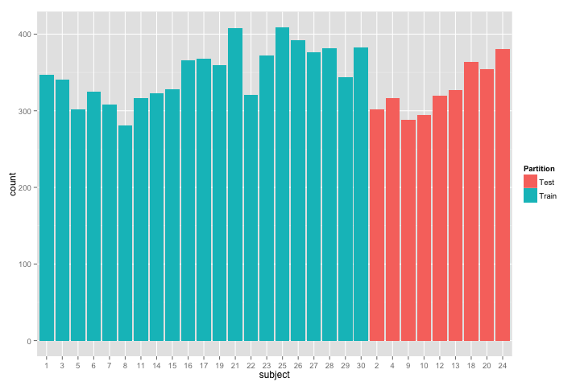
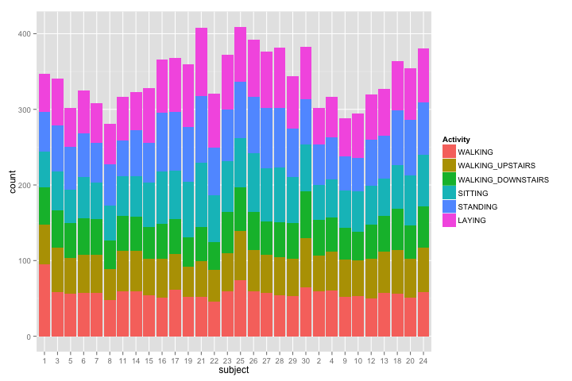

Getting and Cleaning Data Course Project
========================================

The purpose of this project is to demonstrate the ability to collect, work with, and clean a data set. The goal is to prepare tidy data that can be used for later analysis. 

Prelude: One of the most exciting areas in all of data science right now is wearable computing Companies like Fitbit, Nike, and Jawbone Up are racing to develop the most advanced algorithms to attract new users.
- see for example this article:  
<http://www.insideactivitytracking.com/data-science-activity-tracking-and-the-battle-for-the-worlds-top-sports-brand/>
 
The data linked to from the course website represent data collected from the accelerometers from the Samsung Galaxy S smartphone. A full description is available at the site where the data was obtained:
<http://archive.ics.uci.edu/ml/datasets/Human+Activity+Recognition+Using+Smartphones>

The experiments have been carried out with a group of 30 volunteers within an age bracket of 19-48 years. Each person performed six activities (WALKING, WALKING_UPSTAIRS, WALKING_DOWNSTAIRS, SITTING, STANDING, LAYING) wearing a smartphone (Samsung Galaxy S II) on the waist. Using its embedded accelerometer and gyroscope, we captured 3-axial linear acceleration and 3-axial angular velocity at a constant rate of 50Hz. The experiments have been video-recorded to label the data manually. The obtained dataset has been randomly partitioned into two sets, where 70% of the volunteers was selected for generating the training data and 30% the test data. 

The sensor signals (accelerometer and gyroscope) were pre-processed by applying noise filters and then sampled in fixed-width sliding windows of 2.56 sec and 50% overlap (128 readings/window). The sensor acceleration signal, which has gravitational and body motion components, was separated using a Butterworth low-pass filter into body acceleration and gravity. The gravitational force is assumed to have only low frequency components, therefore a filter with 0.3 Hz cutoff frequency was used. From each window, a vector offeatures was obtained by calculating variables from the time and frequency domain. 

Here is the data for the project: 
  <https://d396qusza40orc.cloudfront.net/getdata%2Fprojectfiles%2FUCI%20HAR%20Dataset.zip>

### Plot 1: Partitioning of Training vs Test Data
 

### Plot 2: Subject's Activity Data
 

The Cleaning Script:  run_analysis.R

A single R script called run_analysis.R is built that does the following.
* Downloads & extracts the source ZIP file. 
- If the UCI directory already exists it will skip this step.
* Merges the training and the test sets to create one data set while preserving the test/train partition.
- If the script has been run successfully before, it will also load the data frame directly from uciHarDataset.rda to save from re-processing of the raw data.
* Produces an independent tidy data set with the average of each variable (mean and standard deviation(1)) for each activity and each subject. 

note(1): the average of the standard deviation was a directive of the project.

The Clean Dataset:  tidyData.txt and CodeBook.md

The clean & tidy dataset useable for further analysis, is provided in a WIDE data.frame format via a .txt file. You can load the text file and view the clean dataset simply by:

tidyData <- read.table("tidyData.txt", header = T)
View(tidyData)

the dimensions of tidyData are: 180 observations - 68 variables.
